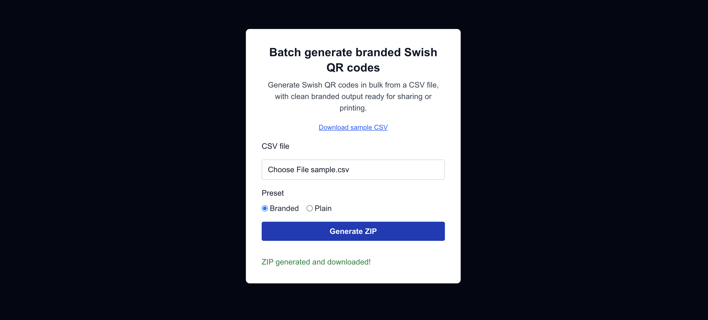

# Swish Batch QR Generator

[](https://github.com/lteyjolfur/swish-batch-prefilled-qr/actions/workflows/ci.yml)
[](LICENSE)

Batch generate branded Swish QR codes from CSV.  
Built to simplify payment collection for clubs and organizations.

[Live Preview](https://swish-batch-prefilled-qr.vercel.app/)



---

## Why this exists

Managing payments for a judo club meant creating multiple Swish QR codes for different groups (age groups, training tiers, etc.).

The official flow on swish.nu is manual and repetitive—fine for one payment, painful for dozens.

This tool was built to batch-generate QR codes with consistent, clean output.

---

## Features

- Upload a CSV to generate QR codes in bulk
- Automatic validation of input data, with per-row error messages
- Branded card output (ready for sharing or printing), or plain QR codes
- Download all generated QR codes as a ZIP
- Simple UI — no login, no database
- Responsive and accessible — scores 100 in all four Lighthouse categories (Performance, Accessibility, Best Practices, SEO)

---

## CSV format

```csv
payee,amount,message,label
1231231234,100,Membership fee,Active Members
1231231234,150,Training fee,Youth Group
```

| Column    | Required | Notes                                                              |
| --------- | -------- | ------------------------------------------------------------------ |
| `payee`   | Yes      | Swish number receiving the payment                                 |
| `amount`  | Yes      | Amount in SEK, greater than 0                                      |
| `message` | Yes      | Payment message, max 50 characters                                 |
| `label`   | No       | Text on the branded card, and the image filename                   |
| `size`    | No       | QR image size in pixels, 300–2000 (default 500)                    |

Limits: up to 200 rows and 1 MB per file. A [sample CSV](public/sample/sample.csv) is included.

All fields are locked in the generated QR code, so the payer can't change the amount or message.

---

## How it works

```
CSV upload ──▶ parse & validate ──▶ Swish QR API ──▶ compose card ──▶ ZIP download
               (Papa Parse)         (5 at a time)    (sharp)          (JSZip)
```

1. The browser posts the CSV to a single route handler, `/api/generate`.
2. Rows are parsed and validated. If any row is invalid, every error is returned at once (`Row 3: Amount must be a valid number`) and nothing is generated.
3. Each row is sent to Swish's public prefilled-QR API, with at most 5 requests in flight.
4. For the branded preset, sharp composites the QR code onto a card and renders the label from a bundled font, so output is identical locally and on Vercel.
5. Images are zipped with filenames taken from the labels. Å/ä/ö are converted (`Årsavgift` → `arsavgift.png`) and duplicate names get a suffix.

The page itself is fully static. All server work happens in the one route handler.

---

## Tech stack

- [Next.js 16](https://nextjs.org/) (App Router) and React 19
- TypeScript
- Tailwind CSS 4
- [sharp](https://sharp.pixelplumbing.com/) and [text-to-svg](https://github.com/shrhdk/text-to-svg) for image composition
- [Papa Parse](https://www.papaparse.com/) and [JSZip](https://stuk.github.io/jszip/)
- [Vitest](https://vitest.dev/) for tests
- Deployed on [Vercel](https://vercel.com/)

---

## Running locally

Requires Node.js 22 or newer.

```bash
npm install
npm run dev
```

The app runs at [http://localhost:3001](http://localhost:3001).

| Script               | What it does                       |
| -------------------- | ---------------------------------- |
| `npm run dev`        | Start the dev server on port 3001  |
| `npm run build`      | Production build                   |
| `npm start`          | Serve the production build         |
| `npm run lint`       | ESLint                             |
| `npm test`           | Run the test suite once            |
| `npm run test:watch` | Run tests in watch mode            |

---

## Testing

The suite covers the CSV parsing and validation, filename generation, the Swish request payload, the rate limiter, and the full `/api/generate` route. Route tests mock `fetch`, so they never call Swish, and assert on the actual ZIP contents, image dimensions, error responses and request concurrency.

CI runs lint, type checking and tests on every push and pull request.

---

## Engineering notes

- **Security headers:** a Content Security Policy without nonces (so the page stays static), plus `X-Frame-Options`, `X-Content-Type-Options`, `Referrer-Policy`, `Permissions-Policy` and HSTS. The `X-Powered-By` header is removed.
- **Abuse protection:** uploads are capped at 1 MB and 200 rows, and `/api/generate` is rate limited to 10 requests per minute per IP. Requests over the limit get a `429` with `Retry-After`. The limiter is in memory per server instance, which is enough to stop casual abuse without extra infrastructure.
- **Accessibility:** labelled inputs, a `fieldset` for the preset choice, live regions so results and errors are announced, and visible keyboard focus states.
- **Dependencies:** kept small and audited; `npm audit --omit=dev` reports no vulnerabilities.

---

## License

[MIT](LICENSE)
